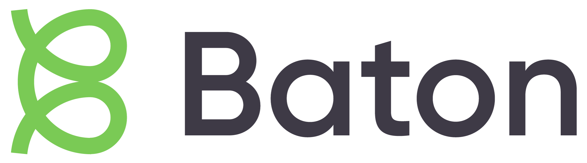

# `baton-snyk` [](https://pkg.go.dev/github.com/conductorone/baton-snyk) 

`baton-snyk` is a connector for Snyk built using the [Baton SDK](https://github.com/conductorone/baton-sdk). It communicates with the Snyk API, to sync data about Snyk group, its organizations and users. 

Check out [Baton](https://github.com/conductorone/baton) to learn more about the project in general.

# Prerequisites

To work with the connector, you need to have a Snyk account along the API token and Group ID that you want to synchronize. For the connector to work, the user or service account represented by the API token must have admin permissions in the group. 

More information on how to obtain API token can be found here: https://docs.snyk.io/getting-started/how-to-obtain-and-authenticate-with-your-snyk-api-token.

Group ID can be found in the URL of the group page in Snyk web platform or in Group general settings.

Snyk is hosted in multiple regions, the connector defaults to "api.snyk.io" (region SNYK-US-01), if hosted in any other region, please specify the proper hostname. For more information visit: https://docs.snyk.io/snyk-api/v1-api#api-urls

# Getting Started

## brew

```
brew install conductorone/baton/baton conductorone/baton/baton-snyk

BATON_GROUP_ID=group_id BATON_API_TOKEN=api_token baton-snyk
baton resources
```

## docker

```
docker run --rm -v $(pwd):/out -e BATON_GROUP_ID=group_id BATON_API_TOKEN=api_token ghcr.io/conductorone/baton-snyk:latest -f "/out/sync.c1z"
docker run --rm -v $(pwd):/out ghcr.io/conductorone/baton:latest -f "/out/sync.c1z" resources
```

## source

```
go install github.com/conductorone/baton/cmd/baton@main
go install github.com/conductorone/baton-snyk/cmd/baton-snyk@main

BATON_GROUP_ID=group_id BATON_API_TOKEN=api_token baton-snyk
baton resources
```

# Data Model

`baton-snyk` will fetch information about the following Snyk resources:

- Group
- Organizations
- Users

By default, connector will fetch all organizations from the account. You can limit the scope of the sync by providing a list of organization ids. You can do that by providing a comma-separated list of organization ids to the `--org-ids` flag.

# Contributing, Support and Issues

We started Baton because we were tired of taking screenshots and manually building spreadsheets. We welcome contributions, and ideas, no matter how small -- our goal is to make identity and permissions sprawl less painful for everyone. If you have questions, problems, or ideas: Please open a Github Issue!

See [CONTRIBUTING.md](https://github.com/ConductorOne/baton/blob/main/CONTRIBUTING.md) for more details.

# `baton-snyk` Command Line Usage

```
baton-snyk

Usage:
  baton-snyk [flags]
  baton-snyk [command]

Available Commands:
  capabilities       Get connector capabilities
  completion         Generate the autocompletion script for the specified shell
  config             Get the connector config schema
  help               Help about any command

Flags:
      --api-token string                                 required: API token representing user or service account, used to authenticate with Snyk API. ($BATON_API_TOKEN)
      --auth-method string                               ($BATON_AUTH_METHOD)
      --client-id string                                 The client ID used to authenticate with ConductorOne ($BATON_CLIENT_ID)
      --client-secret string                             The client secret used to authenticate with ConductorOne ($BATON_CLIENT_SECRET)
      --enable-invitations                               Enable invitation resource synchronization and management. Requires 'org.read', 'org.user.read', and 'org.user.invite' permissions. ($BATON_ENABLE_INVITATIONS)
      --external-resource-c1z string                     The path to the c1z file to sync external baton resources with ($BATON_EXTERNAL_RESOURCE_C1Z)
      --external-resource-entitlement-id-filter string   The entitlement that external users, groups must have access to sync external baton resources ($BATON_EXTERNAL_RESOURCE_ENTITLEMENT_ID_FILTER)
  -f, --file string                                      The path to the c1z file to sync with ($BATON_FILE) (default "sync.c1z")
      --group-id string                                  required: Snyk group ID to scope the synchronization. ($BATON_GROUP_ID)
  -h, --help                                             help for baton-snyk
      --hostname string                                  Snyk instance region hostname (defaults to "api.snyk.io"). ($BATON_HOSTNAME) (default "api.snyk.io")
      --log-format string                                The output format for logs: json, console ($BATON_LOG_FORMAT) (default "console")
      --log-level string                                 The log level: debug, info, warn, error ($BATON_LOG_LEVEL) (default "info")
      --log-level-debug-expires-at string                The timestamp indicating when debug-level logging should expire ($BATON_LOG_LEVEL_DEBUG_EXPIRES_AT)
      --org-ids strings                                  Limit syncing to specified organizations. ($BATON_ORG_IDS)
      --otel-collector-endpoint string                   The endpoint of the OpenTelemetry collector to send observability data to (used for both tracing and logging if specific endpoints are not provided) ($BATON_OTEL_COLLECTOR_ENDPOINT)
  -p, --provisioning                                     This must be set in order for provisioning actions to be enabled ($BATON_PROVISIONING)
      --skip-entitlements-and-grants                     This must be set to skip syncing of entitlements and grants ($BATON_SKIP_ENTITLEMENTS_AND_GRANTS)
      --skip-full-sync                                   This must be set to skip a full sync ($BATON_SKIP_FULL_SYNC)
      --sync-resource-types strings                      The resource type IDs to sync ($BATON_SYNC_RESOURCE_TYPES)
      --sync-resources strings                           The resource IDs to sync ($BATON_SYNC_RESOURCES)
      --ticketing                                        This must be set to enable ticketing support ($BATON_TICKETING)
  -v, --version                                          version for baton-snyk

Use "baton-snyk [command] --help" for more information about a command.
```
